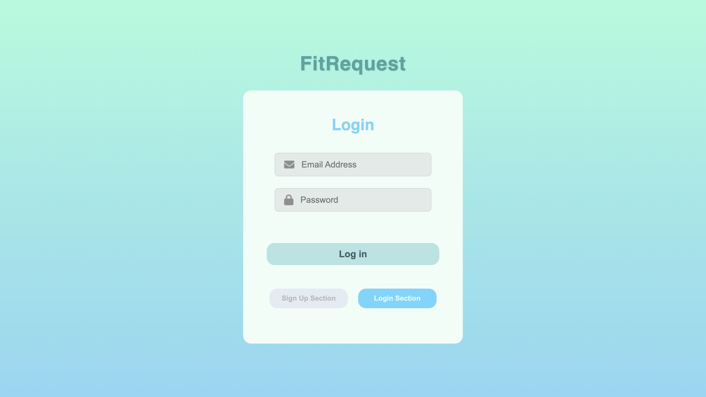
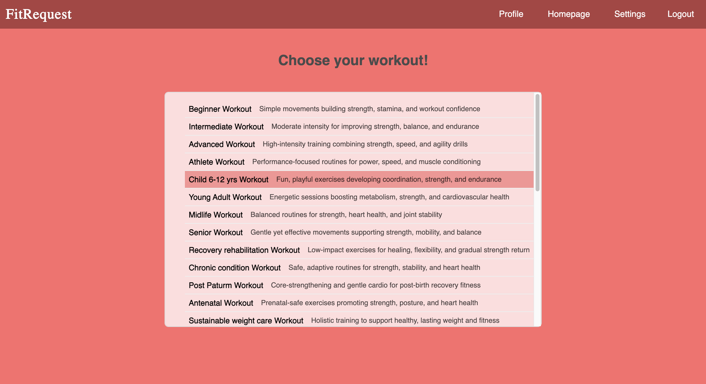
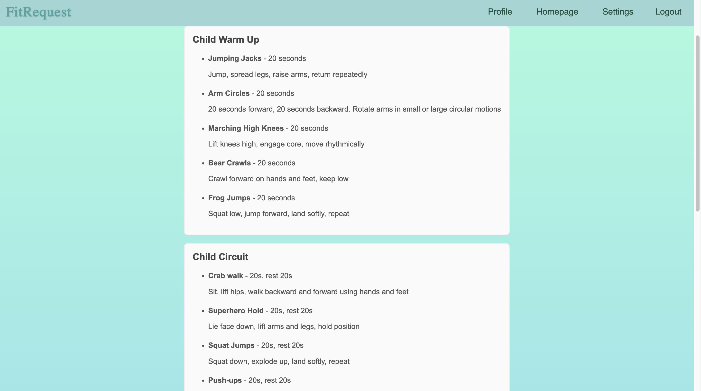
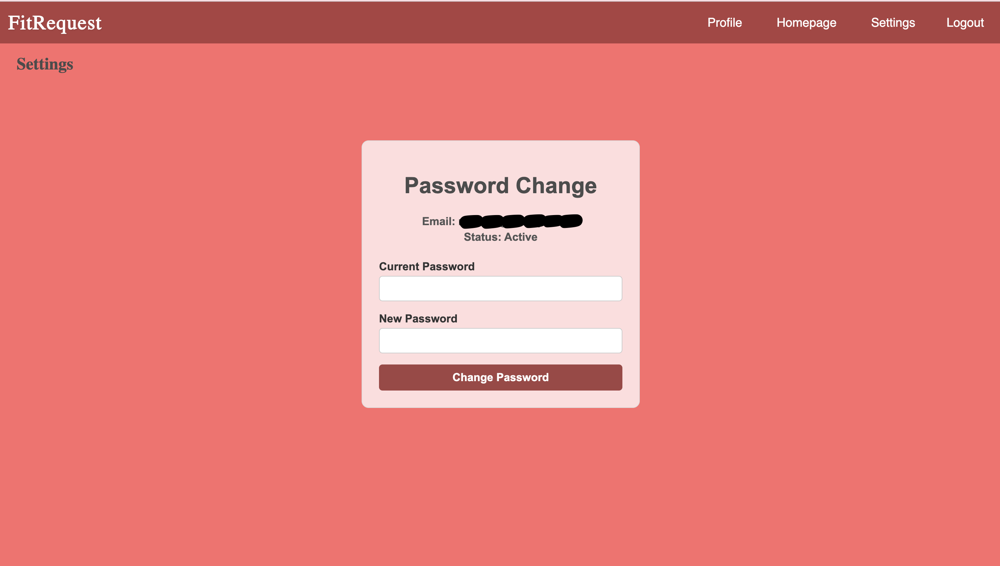
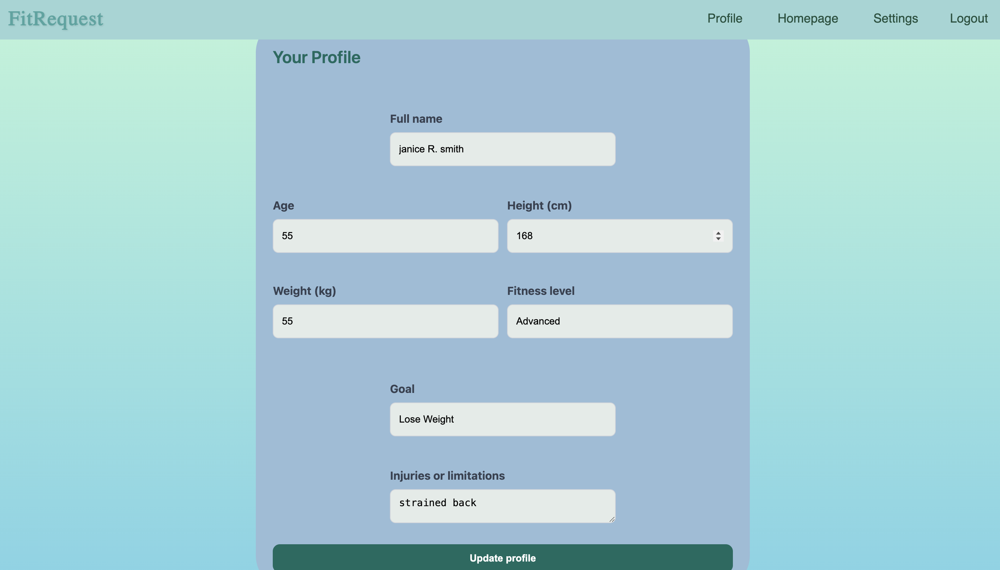
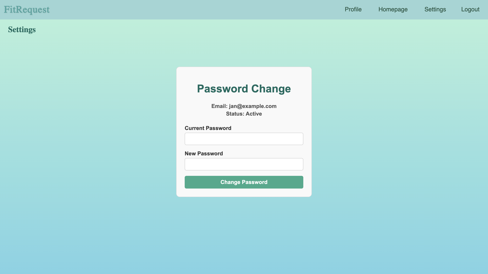

# FitRequest

I built and deployed a fullstack workout request platform where users can request workouts suitable for their needs. 

The application includes user authentication, workouts for the user to browse detailed workout plans. It also includes a password change and a profile section for the user to create or update their profile information. 

## Features

- Secure admin login system allowing authorised users to access the application.

- Clickable workout list navigation which leads to a page of a more detailed workout plan.

- Profile section for users to create and update their profile details such as name, age, height, weight, fitness level, fitness goals and any injuries or limitations.

- Paasword update functionality in the settings section.

- Responsive design ensuring the website works on desktop.

## Built With

### Frontend
- React
- CSS

### Backend
- FastAPI
- SQLAlchemy ORM

### Database
- PostgreSQL
- Neon (database hosting)

### Deployment
- Docker
- Vercel (frontend deployment)
- Fly.io (backend deployment)

### CI/CD
- Github Actions for automated builds and testing and automated backend deployment to Fly.io

## Technical Decisions

- **React** was used to create reusable UI components such as the Navigation bar which made the interface easier to manage.

- **SQLAlchemy** was chosen over SQL to make database operations more secure and to simplify database interactions.

- **Docker** was used on the backend to ensure smooth running of the website in both development and deployed environments.

- **WebAIM** was used to select appropriate colour patterns and improve usability.

- I used **Pytest** to test API endpoints, authentication and database operations to ensure reliability and correct error handling. 

- To set up a **secure** backend, I implemented JWT authentication stored in secure HttpOnly cookies, CSRF protection, bcrypt password hashing, rate limiting, input validation with Pydantic schemas, secure HTTP headers (preventing MIME-type sniffing and iframe embedding), and strict CORS configuration.

- **GitHub Actions** was used to run continuous integration (CI), automate testing and build processes on each commit. Continuous Development (CD) was added for Fly.io as it does not provide automatic deployments by default.

- Neon, Fly.io, and Vercel were used to separate the database, backend, and frontend which gave me experience **managing distributed systems** and improve scalability if needed.

## Live Demo

[**View the live site here**](https://www.fitrequest.dev/)

## Preview

Here is a preview of the website








## Running locally 

### With Docker

1. Clone the repository:
```bash
git clone https://github.com/aimei60/fitrequest.git
cd fitrequest
```

2. Build and start the backend API:
```bash
docker compose up --build
```

3. Start the frontend:
```bash
cd frontend
npm install
npm run dev
```

### Without Docker

1. Clone the repository:
```bash
git clone https://github.com/aimei60/fitrequest.git
cd fitrequest/backend
```

2. Create and activate a virtual environment:
```bash python -m venv venv
source venv/bin/activate
```

3. Install dependencies:
```bash
pip install -r requirements.txt
```

4. Run the API:
```bash
uvicorn main:app --reload
```

5. Start the frontend:
```bash
cd frontend
npm install
npm run dev
```

## Credits

- [GreatStack - React sign up form](https://www.youtube.com/watch?v=8QgQKRcAUvM) - for signup/login styling inspiration.

- [Python API Development](https://www.youtube.com/watch?v=0sOvCWFmrtA) - for learning backend concepts such as CRUD operations, schemas, routers, JWT authentication, Docker, and CI, which I adapted for my own project using Fly.io and Vercel instead of Heroku.
